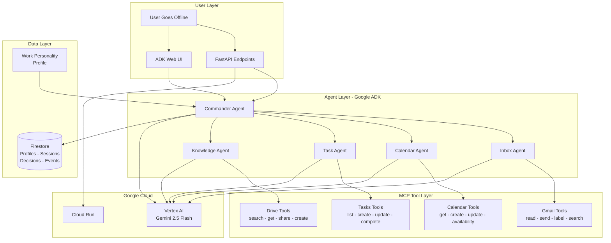

# FutureYou — Your Digital Work Twin

> **Team: Phantom Ops** | Google ADK Hackathon — Gen AI Academy APAC Edition

A **multi-agent AI productivity assistant** built on **Google Agent Development Kit (ADK)** and **Gemini 2.5 Flash** that learns how you work and autonomously handles your emails, meetings, tasks, and documents while you're offline — making real judgment calls based on your Work Personality Profile, not just sending auto-replies.

_"Your AI self, working while you rest."_

---

## Architecture



### How It Works

1. **User goes offline** → activates FutureYou with a mode (`dry-run` or `live`)
2. **Events arrive** (emails, meeting invites, task deadlines, file requests)
3. **Commander Agent** classifies the event and routes to the correct sub-agent
4. **Sub-agent** uses its MCP tools + Work Personality Profile to make decisions
5. **Decision is logged** with reasoning, confidence score, and action taken
6. **User returns** → reviews decision log, can override any decision

---

## Tech Stack

| Layer           | Technology                         | Purpose                                          |
| --------------- | ---------------------------------- | ------------------------------------------------ |
| Agent Framework | **Google ADK**                     | Multi-agent orchestration, routing, tool-calling |
| LLM             | **Gemini 2.5 Flash** via Vertex AI | Reasoning, decision-making, natural language     |
| API             | **FastAPI**                        | REST endpoints for programmatic access           |
| MCP Tools       | **Custom FunctionTools**           | Gmail, Calendar, Tasks, Drive operations         |
| Database        | **Firestore**                      | Profiles, sessions, decisions, events            |
| Deployment      | **Cloud Run**                      | Serverless production hosting                    |
| Auth            | **Vertex AI ADC**                  | Application Default Credentials                  |
| UI              | **ADK Web**                        | Built-in chat interface for interactive testing  |

---

## Multi-Agent System

```
┌──────────────────────────────────────────────────────┐
│                 Commander Agent                       │
│  - Loads Work Personality Profile from Firestore     │
│  - Classifies events and routes to sub-agents        │
│  - Enforces hard limits (budget, legal, hiring)      │
│  - Returns confidence scores (0.0 - 1.0)             │
├──────────┬──────────┬──────────┬─────────────────────┤
│  Inbox   │ Calendar │   Task   │    Knowledge        │
│  Agent   │  Agent   │  Agent   │     Agent           │
│          │          │          │                     │
│ Gmail    │ Calendar │ Tasks    │ Drive               │
│ Tools(4) │ Tools(4) │ Tools(4) │ Tools(4)            │
└──────────┴──────────┴──────────┴─────────────────────┘
```

### MCP Tools (16 total)

| Agent               | Tools            | Operations                                                         |
| ------------------- | ---------------- | ------------------------------------------------------------------ |
| **Inbox Agent**     | `gmail_tools`    | `read_emails`, `send_email`, `label_email`, `search_emails`        |
| **Calendar Agent**  | `calendar_tools` | `get_events`, `create_event`, `update_event`, `check_availability` |
| **Task Agent**      | `tasks_tools`    | `list_tasks`, `create_task`, `update_task`, `complete_task`        |
| **Knowledge Agent** | `drive_tools`    | `search_files`, `get_file`, `share_file`, `create_file`            |

All tools are implemented as **ADK `FunctionTool`** wrappers that integrate with the agents via the MCP protocol.

---

## Work Personality Profile

The profile drives all autonomous decisions:

```json
{
  "communication_style": {
    "tone": "professional yet warm",
    "signature": "Best, Kali",
    "avg_reply_length": "3-5 sentences"
  },
  "calendar_preferences": {
    "max_meetings_per_day": 4,
    "preferred_days": ["Tuesday", "Wednesday", "Thursday"],
    "avoid": ["Monday 9-11 AM", "Friday after 3 PM"],
    "buffer_minutes": 15,
    "auto_accept_from": ["manager@company.com", "cto@company.com"]
  },
  "delegation_rules": {
    "reports_docs": "teammate1@company.com",
    "client_escalations": "manager@company.com",
    "technical_issues": "devlead@company.com"
  },
  "hard_limits": [
    "Never commit to budget decisions",
    "Never share confidential folders",
    "Always flag legal/contract emails for human review",
    "Never delete any emails or files",
    "Never respond to emails about hiring or termination"
  ]
}
```

---

## Project Structure

```
future_you/
├── main.py                    # FastAPI entry point
├── agent.py                   # ADK web entry point (root_agent)
├── futureyou_app/
│   ├── agent.py               # ADK web app (adk web .)
│   └── .env                   # Vertex AI config
├── agents/
│   ├── commander.py           # Commander agent (orchestrator)
│   ├── inbox_agent.py         # Email handling + Gmail tools
│   ├── calendar_agent.py      # Calendar handling + Calendar tools
│   ├── task_agent.py          # Task handling + Tasks tools
│   └── knowledge_agent.py     # Drive handling + Drive tools
├── api/
│   └── routes.py              # All REST API endpoints
├── mcp_server/
│   ├── gmail_tools.py         # 4 Gmail FunctionTools
│   ├── calendar_tools.py      # 4 Calendar FunctionTools
│   ├── tasks_tools.py         # 4 Tasks FunctionTools
│   ├── drive_tools.py         # 4 Drive FunctionTools
│   └── server.py              # Aggregates all 16 tools
├── db/
│   └── firestore.py           # Firestore CRUD operations
├── profile/
│   ├── seed_profile.json      # Pre-built demo profile
│   ├── builder.py             # Profile loader
│   └── schema.py              # Pydantic models
├── Dockerfile                 # Cloud Run container
├── cloudbuild.yaml            # Cloud Build config
└── requirements.txt           # Python dependencies
```

---

## Quick Start

### Prerequisites

- Python 3.11+
- Google Cloud project with Vertex AI, Firestore, Cloud Run enabled
- `gcloud` CLI authenticated

### Local Development

```bash
# Clone
git clone https://github.com/jkaliraj/future_you.git
cd future_you

# Install
pip install -r requirements.txt

# Set environment
export GOOGLE_CLOUD_PROJECT=futureyou-agent
export GOOGLE_GENAI_USE_VERTEXAI=TRUE
export GOOGLE_CLOUD_LOCATION=us-central1

# Run combined server (ADK Web UI + REST API on same port)
python -m uvicorn main:app --host 0.0.0.0 --port 8080
# → ADK Web UI: http://localhost:8080
# → REST API:   http://localhost:8080/api/*
```

### Standalone ADK Web UI (alternative)

```bash
export PATH="$HOME/.local/bin:$PATH"
pip install google-adk
adk web . --allow_origins="*"
# Open http://localhost:8000 → Select "futureyou_app"
```

---

## API Usage — Full Demo Flow

### Step 1: Onboard (Load Profile)

```bash
curl -s -X POST http://localhost:8080/api/onboard \
  -H "Content-Type: application/json" \
  -d '{"user_id":"demo-user"}' | python3 -m json.tool
```

### Step 2: Activate Session (Go Offline)

```bash
curl -s -X POST http://localhost:8080/api/activate \
  -H "Content-Type: application/json" \
  -d '{
    "user_id": "demo-user",
    "mode": "dry-run",
    "duration_minutes": 180,
    "message": "In a meeting, back by 3 PM"
  }' | python3 -m json.tool
```

### Step 3: Trigger Events

**Email from CEO (priority contact):**

```bash
curl -s -X POST http://localhost:8080/api/trigger-event \
  -H "Content-Type: application/json" \
  -d '{
    "user_id": "demo-user",
    "event_type": "email",
    "payload": {
      "from": "ceo@company.com",
      "subject": "Q3 Strategy Review",
      "body": "Please review the attached deck and reply by EOD."
    }
  }' | python3 -m json.tool
```

**Calendar invite:**

```bash
curl -s -X POST http://localhost:8080/api/trigger-event \
  -H "Content-Type: application/json" \
  -d '{
    "user_id": "demo-user",
    "event_type": "calendar",
    "payload": {
      "from": "manager@company.com",
      "title": "1:1 Sync",
      "day": "Wednesday",
      "time": "2:00 PM"
    }
  }' | python3 -m json.tool
```

**Task deadline:**

```bash
curl -s -X POST http://localhost:8080/api/trigger-event \
  -H "Content-Type: application/json" \
  -d '{
    "user_id": "demo-user",
    "event_type": "task",
    "payload": {
      "title": "Q3 Financial Report",
      "due": "tomorrow",
      "type": "reports & docs"
    }
  }' | python3 -m json.tool
```

**File request:**

```bash
curl -s -X POST http://localhost:8080/api/trigger-event \
  -H "Content-Type: application/json" \
  -d '{
    "user_id": "demo-user",
    "event_type": "file",
    "payload": {
      "request": "Find Q3 strategy deck and share with manager@company.com"
    }
  }' | python3 -m json.tool
```

### Step 4: View Decisions

```bash
curl -s http://localhost:8080/api/decisions/demo-user | python3 -m json.tool
```

### Step 5: View Profile

```bash
curl -s http://localhost:8080/api/profile/demo-user | python3 -m json.tool
```

### Step 6: Deactivate (Come Back Online)

```bash
curl -s -X POST http://localhost:8080/api/deactivate \
  -H "Content-Type: application/json" \
  -d '{
    "user_id": "demo-user",
    "session_id": "SESSION_ID_FROM_STEP_2"
  }' | python3 -m json.tool
```

---

## Deploy to Cloud Run

```bash
# 1. Set project
gcloud config set project futureyou-agent

# 2. Enable APIs
gcloud services enable \
  cloudbuild.googleapis.com \
  run.googleapis.com \
  artifactregistry.googleapis.com \
  firestore.googleapis.com \
  aiplatform.googleapis.com

# 3. Deploy (auto-builds from source)
gcloud run deploy futureyou \
  --source . \
  --region us-central1 \
  --allow-unauthenticated \
  --set-env-vars "GOOGLE_CLOUD_PROJECT=futureyou-agent,GOOGLE_GENAI_USE_VERTEXAI=TRUE,GOOGLE_CLOUD_LOCATION=us-central1" \
  --memory 1Gi \
  --timeout 300

# 4. Test the deployed URL
URL="https://futureyou-XXXXX-uc.a.run.app"
curl -s $URL/health
# ADK Web UI: open $URL in browser
# REST API:
curl -s -X POST $URL/api/onboard -H "Content-Type: application/json" \
  -d '{"user_id":"demo-user"}' | python3 -m json.tool
```

---

## Key Features

| Feature                      | Description                                                          |
| ---------------------------- | -------------------------------------------------------------------- |
| **Multi-Agent Routing**      | Commander classifies events and delegates to specialized sub-agents  |
| **16 MCP Tools**             | Gmail, Calendar, Tasks, Drive — all wired to agents via FunctionTool |
| **Work Personality Profile** | JSON-based profile drives all autonomous decisions                   |
| **Dry-Run Mode**             | Agent explains what it WOULD do without executing actions            |
| **Hard Limits**              | Enforced rules that the agent NEVER violates (budget, legal, hiring) |
| **Decision Log**             | Every action logged with reasoning and confidence score              |
| **Human Override**           | User can review and override any decision                            |
| **ADK Web UI**               | Built-in interactive chat for live testing                           |
| **Firestore Persistence**    | Profiles, sessions, decisions stored across restarts                 |

---

## License

MIT

---

_Built with Google ADK, Gemini 2.5 Flash, and Firestore for the Google Gen AI Academy APAC Hackathon._
